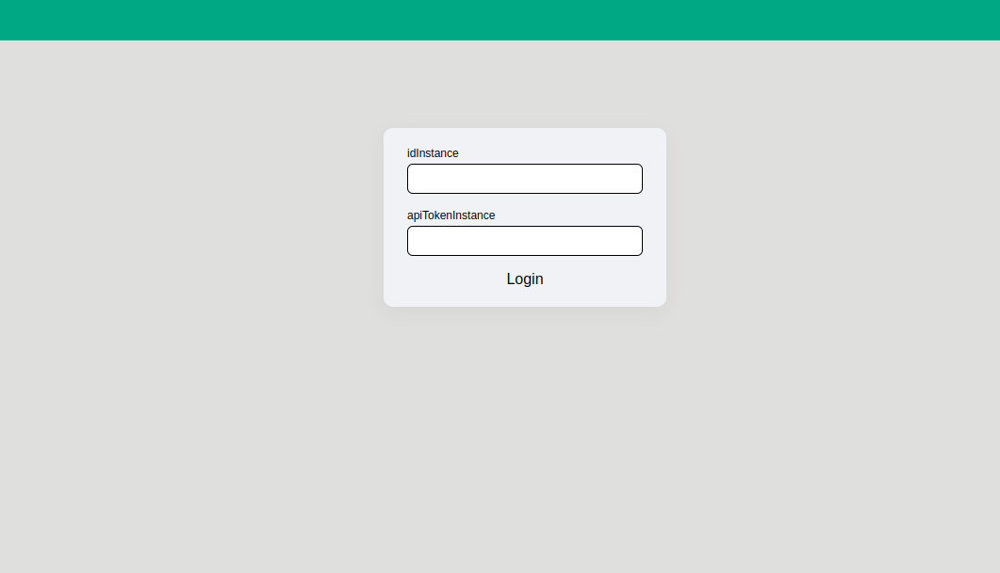
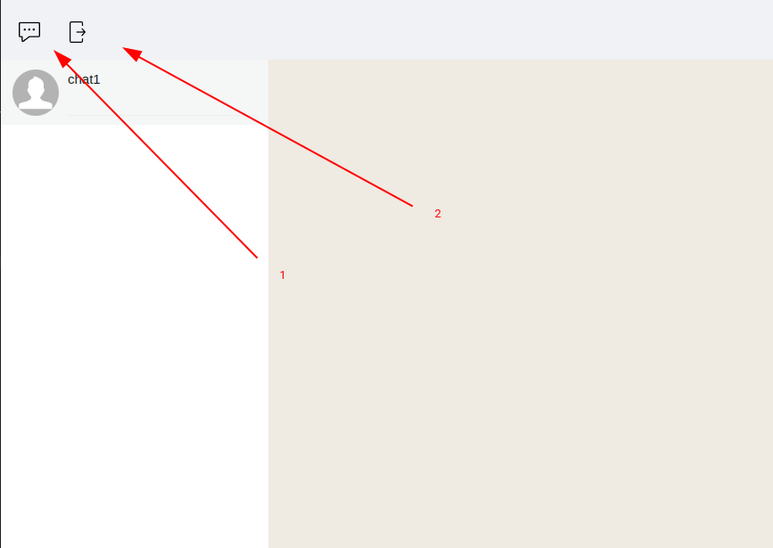
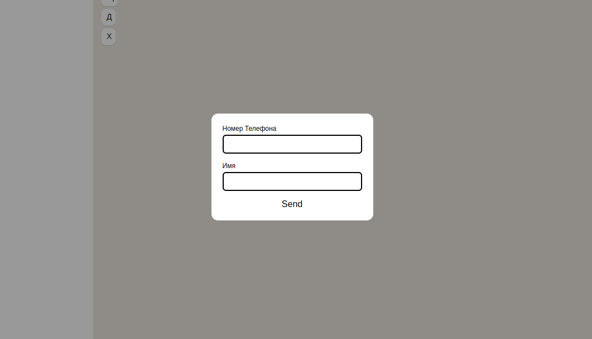
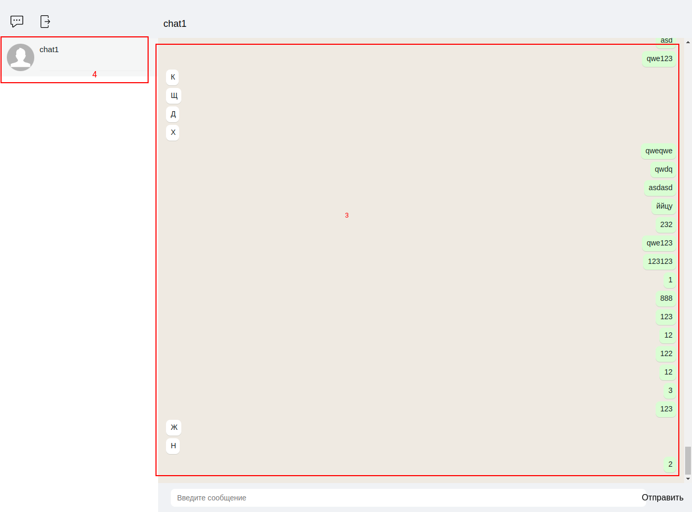

## test-web-messenger

1. npm install;
2. npm start

## Стек технологий

- React, TypeScript
- SCSS
- LocalStorage

## Реализовано

Страница - LoginPage вводит полученный на сайте green-api.com idinstance и apiToken.
После нажатия на кнопку login, перенаправляет на страницу MessengerPage.

1. Кнопка для активации модального окна, для создания чата.
2. Выход из аккаунта.

Модальное окно,в котором вводим номер телефона и названия чата.

3. Наш чат.
4. История чата.

